Motor calibration needs motor connections.  

Lock-in spin is used during startup or calibration to synchronize the motor's electrical parameters with its mechanical position.  

Why does AXIS_STATE_STARTUP_SEQUENCE skip hall calibration? config_.hall_polarity_calibrated can be set solely by Encoder::run_hall_polarity_calibration. Maybe we should initialize requested_state_ to AXIS_STATE_FULL_CALIBRATION_SEQUENCE. But how to enter closed loop control after that? It seems better to add hall calibration to the startup sequence.  
However, hall polarity calibration takes 3 seconds, and get the same result for every sensor of the same type. So it is not very useful to do it every time during startup. Oh, hall_polarity_calibrated would be written to NVM after calibration, so it is done only once. Then no modification is needed, but we should ensure that hall polarity calibration is done at least once before using the motor.  

Axis.cpp is a FSM. The key operation for state switching is connecting/disconnecting relevant ports.Updates for motor, encoder, controller are done in interrupts, while state switching is done in thread context.  

There are three implemented control laws: FieldOrientedController, ResistanceMeasurementControlLaw, and InductanceMeasurementControlLaw. They all inherit from AlphaBetaFrameController class. The unified interface on_measurement passes in the key measurement. Motor.arm(&control_law) connects the control law to the motor. Motor disarm() disconnects it.  

Remember to modify Encoder::config_.cpr after we choose a different encoder.  
In Encoder::update(), 
```cpp
    // Outputs from Encoder for Controller
    pos_estimate_ = pos_estimate_counts_ / (float)config_.cpr;
    vel_estimate_ = vel_estimate_counts_ / (float)config_.cpr;
```
while the unit of pos_estimate_ is in turns, and vel_estimate_ is in turns/s, and config_.cpr remains the resolution of abs encoder. This may cause problems, especially when we use position control mode.  

### Initialization Order
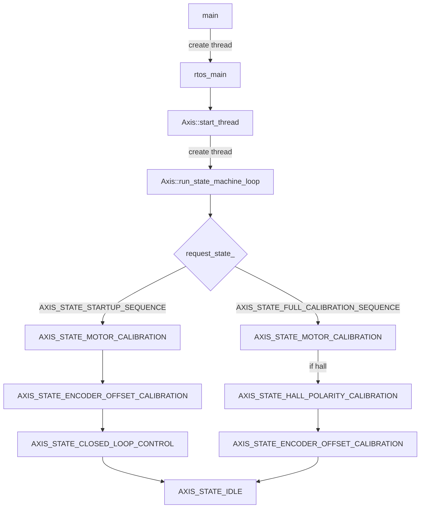
Notice: Encoder offset calibration requires hall polarity to be calibrated first if hall sensor is used. Hall polarity calibration is only done once and saved to NVM.  

### Closed Loop Control
Notice: In encoder calibration (hall polarity, hall phase, direction find, offset calibration), the motor is connected to open loop controller. Otherwise the motor is connected to closed loop controller (Axis.controller_).

control loop period: 2 * HRTIM_PERIOD_CLOCKS * (HRTIM_REP + 1)

Timeline of closed loop control (unit: clocks):  
0: HRTIM timer A repetition event (preempt priority 0, subpriority 0), conting up. 
- trigger ADC conversion.
- Zfoc::sampling_cb --> Encoder::sample_now
- trigger SPI1 interrupt through NVIC, where we run ControlLoop_IRQHandler.   

Right after HAL_HRTIM_RepetitionEventCallback: SPI1 interrupt (ControlLoop_IRQHandler) (preempt priority 5, subpriority 0). Will be preempted by Timer A repetition event interrupt. 
- fetch current from ADC DMA buffer *and vbus from CAN_B (to be implemented)*
- Motor::current_meas_cb --> Motor::control_law_->on_measurement. Informs the control law (in closed loop control, Motor.current_control_, i.e. FOC controller) about a new set of measurements.
- Zfoc::control_loop_cb:
    - reset all output ports
    - Axis::do_checks & Axis::watchdog_check
    - Encoder::update() to update position and velocity estimates
    - Axis.controller_.update() to update control outputs (torque) using position and velocity from encoder
    - Axis.open_loop_controller_.update() to update open loop control outputs (Idq, Vdq, phase, phase_vel, total distance)
    - Motor::update() to update Vdq setpoint based on torque setpoint from controller or open loop controller and phase_vel from encoder
    - Motor.current_control_.update() to update FOC controller's inputs (Idq, Vdq, phase, phase_vel)  
    - set signals to tell the axis threads that the control loop has finished (Axis::wait_for_control_iteration)
- wait for the second ADC conversion to be triggered by HRTIM timer A repetition event.

HRTIM_PERIOD_CLOCKS * (HRTIM_REP + 1): HRTIM timer A repetition event, conting down.  
- trigger ADC conversion.
- Tentatively reset all PWM outputs to 50% duty cycles. If the control loop handler finishes in time then these values will be overridden before they go into effect.

Right after HAL_HRTIM_RepetitionEventCallback: SPI1 interrupt (ControlLoop_IRQHandler) (continued).
- fetch current from ADC DMA buffer *and vbus from CAN_B (to be implemented)*  
- Motor::dc_calib_cb
- Motor::pwm_update_cb. Get pwm timings from Motor.control_law_ and apply.

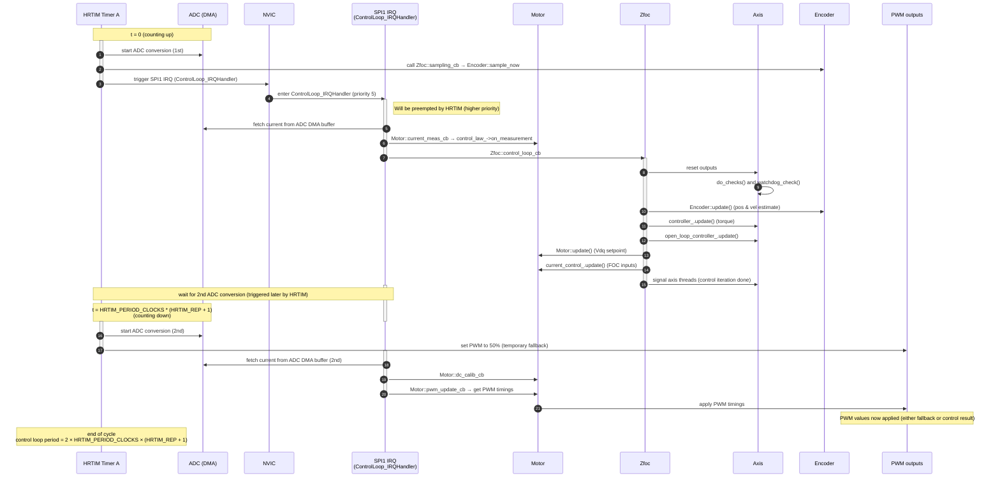

### CAN protocol
Overview
- Identifier layout (standard 11-bit or extended 29-bit):
  - cmd_id: lower 5 bits (bits 0–4)
  - node_id: all higher bits (shift right by 5)
  - Frame ID = (node_id << 5) | cmd_id
  - Extended vs standard is matched via msg.isExt and axis.config_.can.is_extended
- Subscription filter:
  - mask = 0xffffffff << 5
  - id = node_id << 5 (standard or extended depending on axis config)
- “Get” semantics:
  - For most “GET_…” commands, a request has RTR set (or len == 0). Device replies with a data frame.
- Periodic telemetry:
  - service_stack() sends periodic frames per Axis.config_.can.*_rate_ms fields.

Periodic/Broadcast
- Heartbeat (cmd: MSG_ZFOC_HEARTBEAT)
  - Tx only (periodic per heartbeat_rate_ms)
  - Payload (8 bytes):
    - u32 error (bits 0–31): axis.error_
    - u8 current_state (bits 32–39)
    - u8 motorFlags (bits 40–47): nonzero if motor error
    - u8 encoderFlags (bits 48–55): nonzero if encoder error
    - u8 controllerFlags (bits 56–63): nonzero if controller error; bit7 indicates trajectory_done

Commands
- MSG_ZFOC_ESTOP
  - Set: no payload; triggers E-stop (sets Axis::ERROR_ESTOP_REQUESTED)

- MSG_GET_MOTOR_ERROR
  - Get: RTR or len==0
  - Reply: u64 motor_.error_

- MSG_GET_ENCODER_ERROR
  - Get: RTR or len==0
  - Reply: u32 encoder_.error_

- MSG_GET_CONTROLLER_ERROR
  - Get: RTR or len==0
  - Reply: u32 controller_.error_

- MSG_SET_AXIS_NODE_ID
  - Set: u32 node_id

- MSG_SET_AXIS_REQUESTED_STATE
  - Set: i32 requested_state (Axis::AxisState)

- MSG_SET_AXIS_STARTUP_CONFIG
  - Not implemented

- MSG_GET_ENCODER_ESTIMATES
  - Get: RTR or len==0
  - Reply: f32 pos_estimate, f32 vel_estimate

- MSG_GET_ENCODER_COUNT
  - Get: RTR or len==0
  - Reply: i32 shadow_count, i32 count_in_cpr

- MSG_SET_CONTROLLER_MODES
  - Set: i32 control_mode, i32 input_mode
  - Applies and calls control_mode_updated()

- MSG_SET_INPUT_POS
  - Set (packed):
    - f32 position
    - i16 velocity_scaled = velocity / 0.001
    - i16 torque_scaled = torque / 0.001
  - Calls input_pos_updated()

- MSG_SET_INPUT_VEL
  - Set: f32 velocity, f32 torque

- MSG_SET_INPUT_TORQUE
  - Set: f32 torque

- MSG_SET_LIMITS
  - Set: f32 controller.vel_limit, f32 motor.current_lim

- MSG_START_ANTICOGGING
  - Set: no payload; starts anticogging calibration

- MSG_SET_TRAJ_VEL_LIMIT
  - Set: f32 trap_traj.config.vel_limit

- MSG_SET_TRAJ_ACCEL_LIMITS
  - Set: f32 accel_limit, f32 decel_limit

- MSG_SET_TRAJ_INERTIA
  - Set: f32 controller.config.inertia

- MSG_GET_IQ
  - Get: RTR or len==0
  - Reply: f32 Iq_setpoint, f32 Iq_measured

- MSG_RESET_ZFOC
  - Set: no payload; MCU reset

- MSG_GET_BUS_VOLTAGE_CURRENT
  - Get: RTR or len==0
  - Reply: f32 vbus_voltage, f32 ibus

- MSG_CLEAR_ERRORS
  - Set: no payload; clears all errors (global zfoc.clear_errors())

- MSG_SET_LINEAR_COUNT
  - Set: i32 linear_count; encoder_.set_linear_count()

- MSG_SET_POS_GAIN
  - Set: f32 controller.config.pos_gain

- MSG_SET_VEL_GAINS
  - Set: f32 vel_gain, f32 vel_integrator_gain

- MSG_GET_ADC_VOLTAGE
  - Request: u8 gpio_num (no RTR)
  - Reply: f32 voltage (only if gpio_num < GPIO_COUNT)

Timing/periodics (per-axis)
- Configurable rates in Axis::Config_t::CANConfig_t:
  - heartbeat_rate_ms
  - encoder_rate_ms (pos/vel estimates)
  - motor_error_rate_ms
  - encoder_error_rate_ms
  - controller_error_rate_ms
  - encoder_count_rate_ms
  - iq_rate_ms
  - bus_vi_rate_ms
- Each nonzero rate triggers the corresponding “GET_…” callback to send data periodically.

Packing conventions
- Signals are placed at bit offsets per can_setSignal/can_getSignal.
- Floats are IEEE-754 32-bit.
- Integer fields use two’s complement.
- Scaled fields:
  - In MSG_SET_INPUT_POS, velocity and torque are i16 with scale 0.001 (value = raw * 0.001).


Changing stack_size_default_task from 128 to 512 fixed the stack-overflow problem.  

Update on repetition must be enabled, or we can't enter repetition interrupt.  
  
  
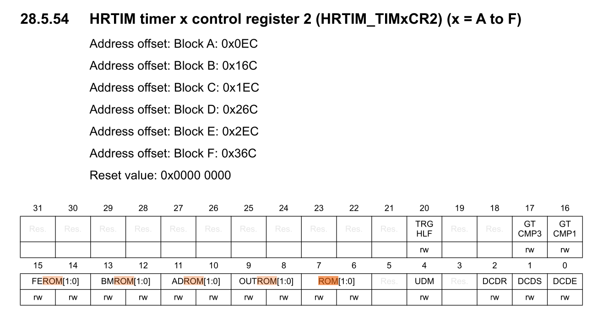  

Well, let's not stick to HRTIM repetition counter (at least for now, let it go to hell). Just use Timer D to generate the timer_update interrupt.  

When using 50kHz PWM frequency, timer_update interrupt would be triggered twice consecutively, without returning to control_loop_handler in between. As we change PWM frequency to 3125Hz, control_loop_handler will directly run through before the second timer_update interrupt happens. This is because we wait for ADC conversion to complete in the middle of control_loop_handler, which does not guarantee the secend timer_update would happen before control_loop_handler ends. To address this uncertainty, we wait for Timer A to "count down" (this cumbersome peripheral is actually running in up-counting mode, though I tried my best to make it count up and down) in addition. The above machanism also implies the upper limit of PWM frequency.  
Wait, ADC was triggered at the same time as timer_update interrupt by Timer D. Now we try to trigger ADC in timer_update interrupt handler instead, and find that ADC conversion doesn't complete at all. This is most likely because $V_{DDA}$ is to low. But why we didn't get blocked forever before? Maybe because ADC was never triggered at all.  

For detecting ADC conversion completion, use EOS flag instead of EOC as we have configured. This may be the reason why ADC conversion never completes!!  
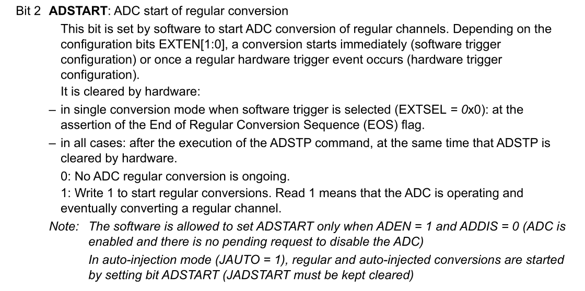

Configure filter, or fdcan won't work.  
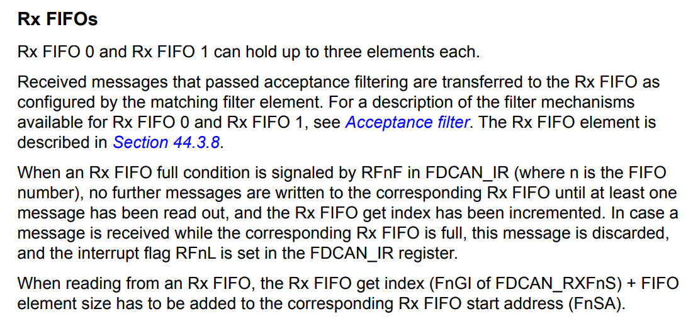  
Configure hfdcan.Instance before initialization.

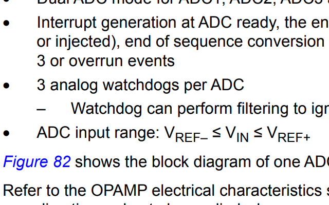  
I have misunderstood the function of V_REF+ in ADC. It is not the balance point, but the constraint of maximum input voltage. So I'm connecting V_REF+ to V_DDA.  
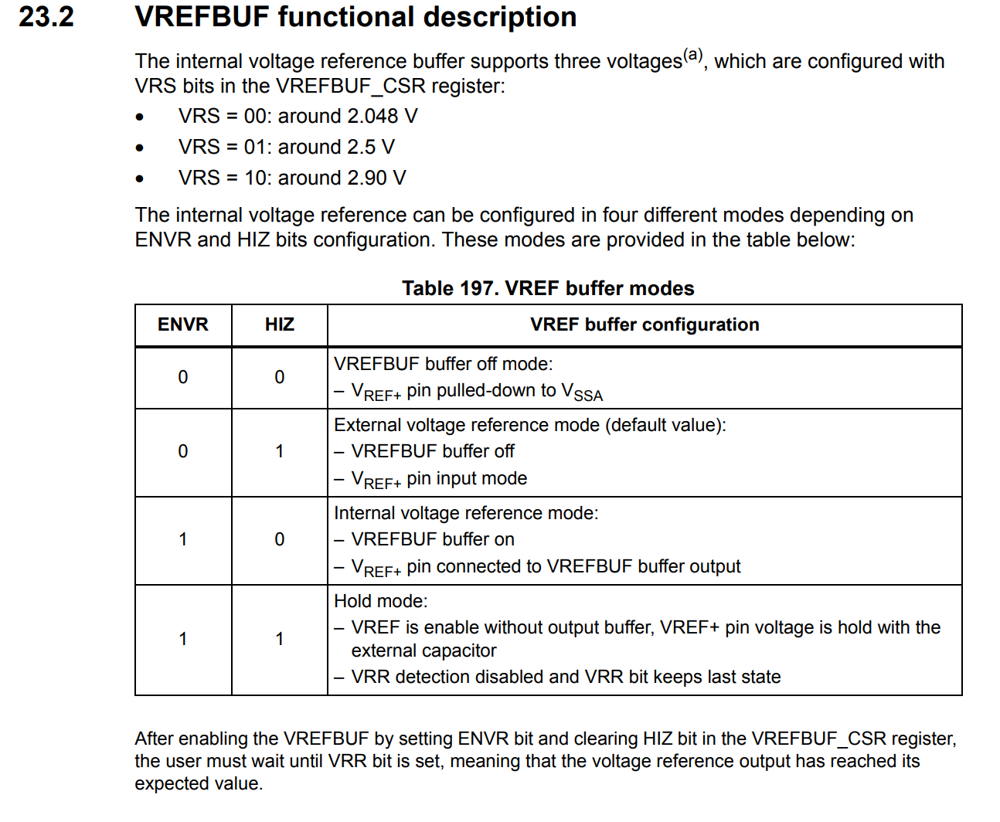  
Unfortunately, we can't connect V_REF+ to 3.3V directly, as it is required by the current sense amplifiers. So we use voltage reference buffer instead.  
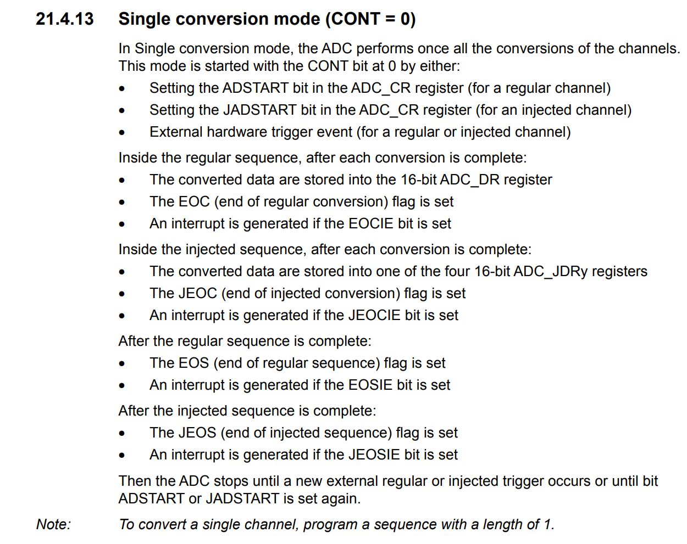  
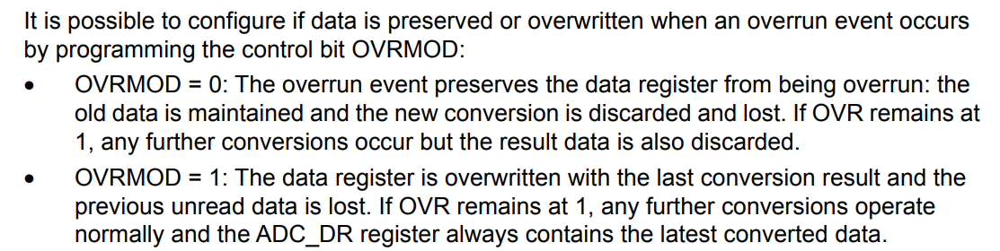  
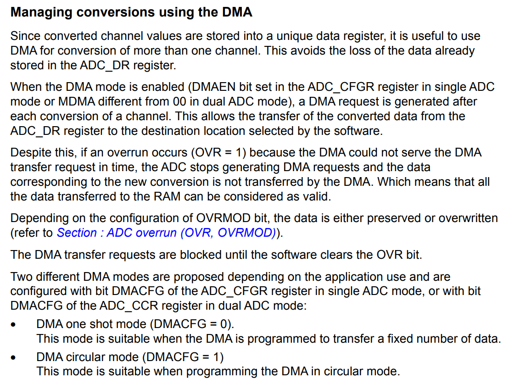  
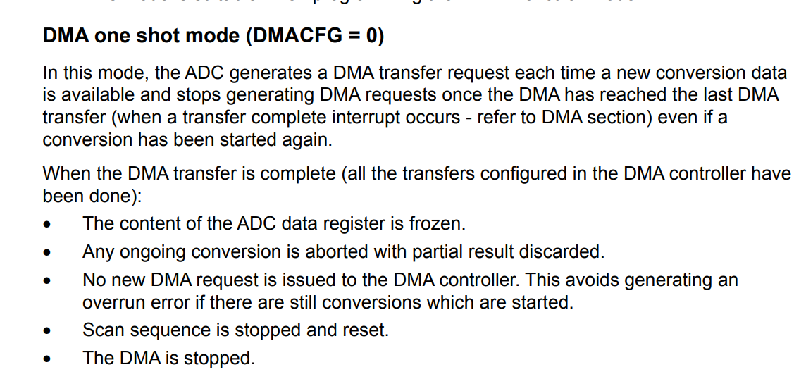  
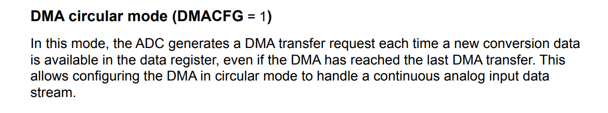  
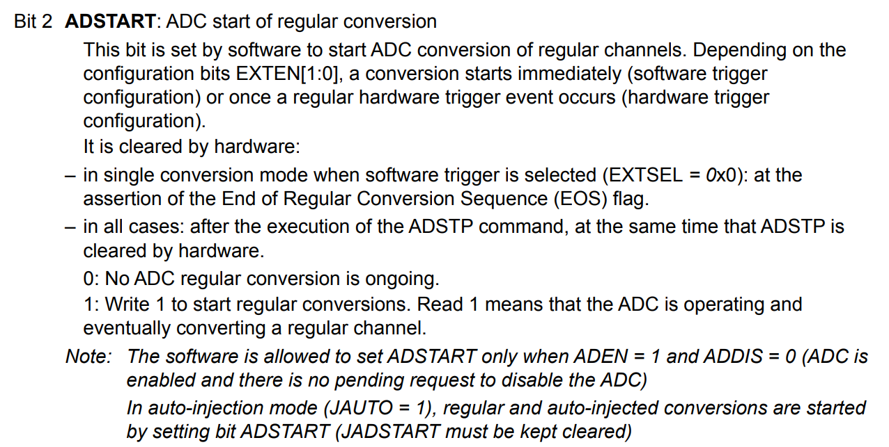  
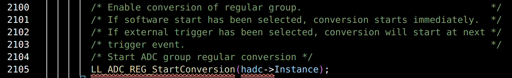  


